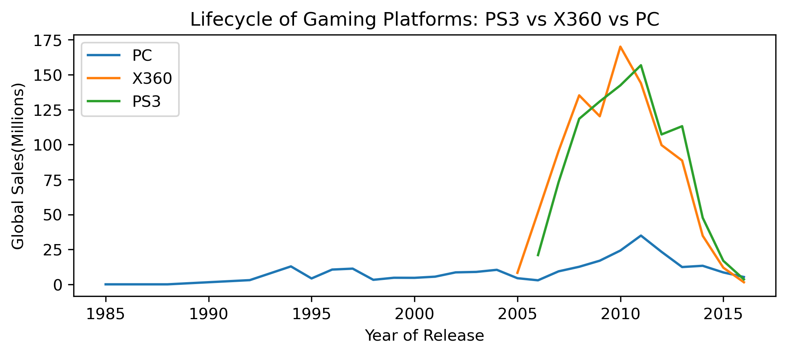
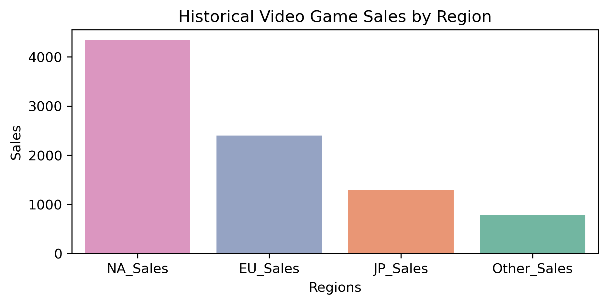
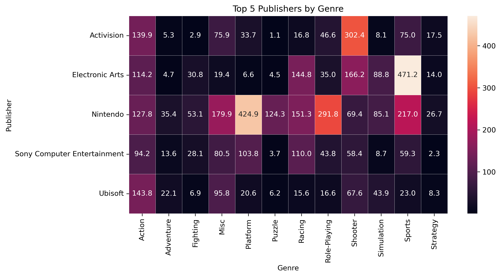
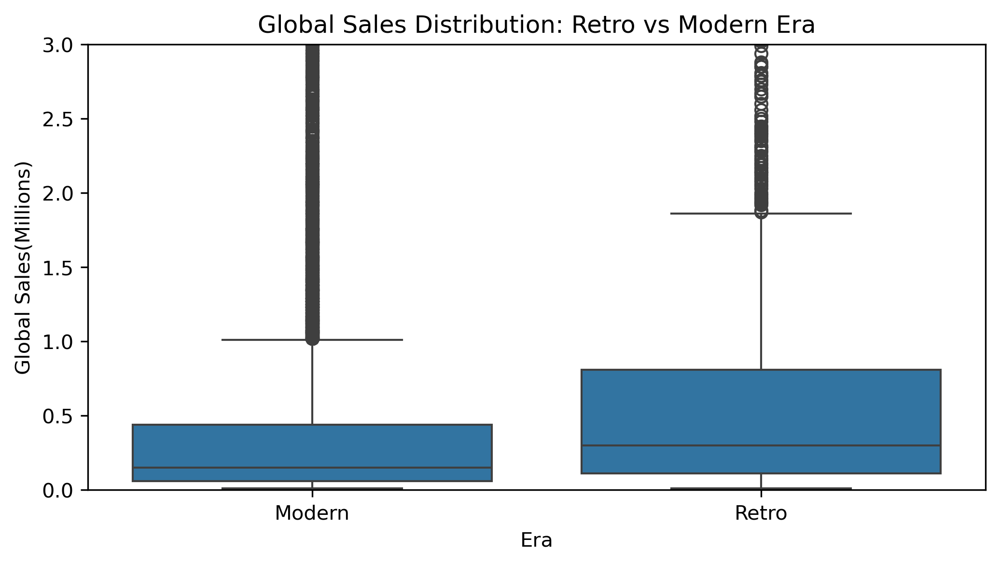
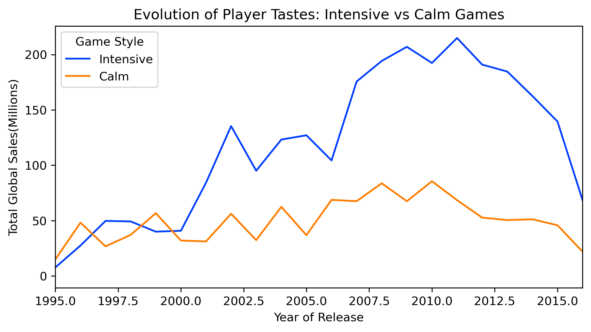

# Video Game Sales: Market Insights & Trends

## 🎮 Project Overview
This project is an Exploratory Data Analysis (EDA) of the global video game market. Using a dataset of over 16,000 games, I investigated publisher strategies, market monopolies, and the evolution of player tastes.

## 🔗Dataset:
 https://www.kaggle.com/datasets/gregorut/videogamesales

## 📌Key Business Insights
* The Pareto Effect: Discovered that the top 1% of games account for 21% of total global sales, proving a high-concentration market.
* The Wii Sports Anomaly: Identified and explained why the #1 best-selling game has double the sales of its closest competitor due to hardware bundling.
* Platform Lifecycles: Analyzed the 8-10 year lifecycle of consoles vs. the long-term stability of the PC market.
* Genre Evolution: Tracked the shift between "Intensive" (Action/Shooter) and "Calm" (RPG/Adventure) genres over two decades.

## 🚀Tech Stack
* Language: Python 3.x
* Libraries: Pandas, NumPy, Matplotlib, Seaborn
  
## 📊 Visualizations

